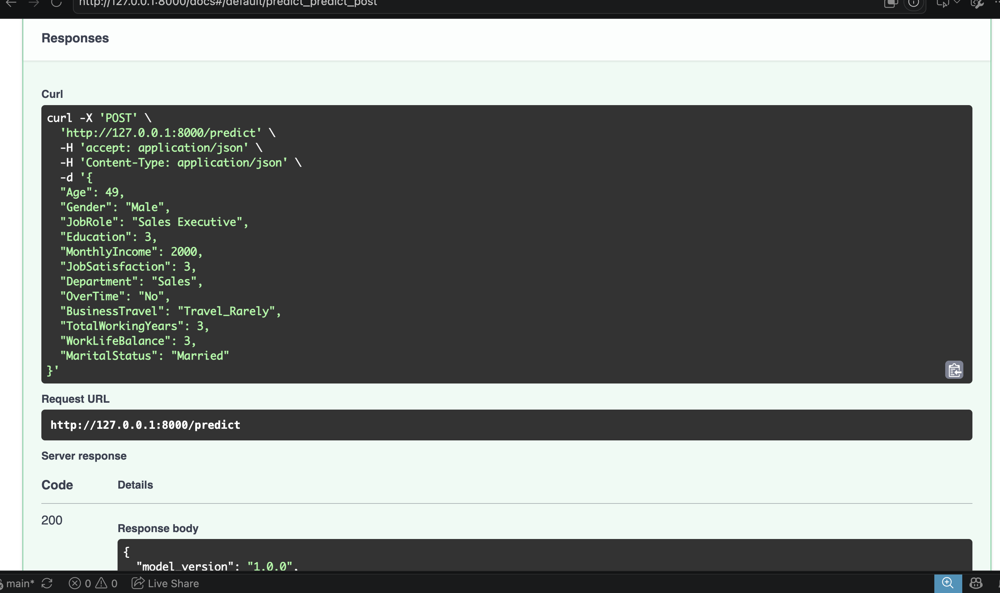
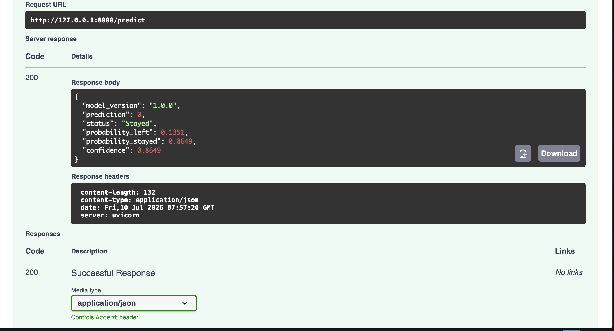

# Employee Attrition Prediction API

A machine learning REST API that predicts whether an employee is likely to leave a company (**attrition**), built with **FastAPI** and a **scikit-learn Logistic Regression** pipeline. The service takes a set of HR-related employee attributes and returns a prediction, class probabilities, and a confidence score.

## Overview

Employee attrition is costly for organizations, and HR teams benefit from early, data-driven signals about which employees may be at risk of leaving. This project trains a Logistic Regression classifier on the **IBM HR Analytics Employee Attrition & Performance** dataset and exposes it as a lightweight, production-style REST API.

The API accepts a subset of employee attributes from the caller (e.g. age, department, job role, income, overtime status), merges them with sensible default values for the remaining model features, and returns:

- The predicted outcome (`Stayed` or `Left`)
- The probability of each class
- A confidence score for the predicted class

The project is intentionally structured to mirror an industry-style layout, separating the model training notebook, the request/response schema, and the API layer into their own modules.

## Features

- **FastAPI-based REST API** with automatic interactive docs (Swagger UI / ReDoc)
- **Pydantic-validated request schema** — invalid inputs (wrong types, out-of-range values, unknown categories) are rejected before reaching the model
- **Pre-trained scikit-learn pipeline** (encoding + scaling + model) loaded via `joblib`, so no retraining is needed to serve predictions
- **Class-imbalance-aware model** selected specifically to improve recall on the minority ("left the company") class
- **Health check endpoint** for uptime/readiness monitoring (e.g. load balancers, container orchestrators)
- **Probability and confidence scores** returned alongside the prediction, not just a bare label

## Model Information

| Aspect | Details |
|---|---|
| **Dataset** | IBM HR Analytics Employee Attrition & Performance (1,470 employees, 35 original columns) |
| **Target** | `Attrition` (`Yes` / `No`), label-encoded to `1` / `0` |
| **Class balance** | Imbalanced — 1,233 "No" vs. 237 "Yes" |
| **Preprocessing** | `ColumnTransformer` combining `OneHotEncoder` (categorical features) and `StandardScaler` (numerical features) |
| **Algorithm** | `LogisticRegression(class_weight='balanced', max_iter=1000)` |
| **Serialization** | `joblib` (`employee_attrition_pipeline.pkl`), containing the full preprocessing + model pipeline |

**Why `class_weight='balanced'`?** A baseline Logistic Regression model reached 89.5% accuracy but only 46.2% recall on employees who actually left — meaning it missed more than half of the at-risk employees. Since a false negative (missing an employee who is about to leave) is the costlier business error, a class-balanced model was chosen instead, trading some accuracy for meaningfully better recall.

| Metric | Baseline model | Final (balanced) model |
|---|---|---|
| Accuracy | 89.5% | 71.4% |
| Recall (attrition class) | 46.2% | 56.4% |
| Precision (attrition class) | 64.3% | 24.7% |

Full exploratory data analysis, preprocessing, training, and evaluation steps are documented in `Model/churn_EDA.ipynb`.

Not every feature the model was trained on is exposed through the API. Twelve of the more interpretable, user-friendly attributes (age, gender, job role, education, income, job satisfaction, department, overtime, business travel, total working years, work-life balance, marital status) are collected from the caller; the remaining features the pipeline expects are filled in with fixed default values.

## API Endpoints

| Method | Path | Description |
|---|---|---|
| `GET` | `/` | Welcome message / liveness check |
| `GET` | `/health` | Machine-readable health check, returns API status and model version |
| `POST` | `/predict` | Accepts employee attributes and returns an attrition prediction |

## Installation

**Prerequisites:** Python 3.11+ and `pip` (the project was developed and tested with Python 3.14)

```bash
# Clone the repository
git clone <your-repo-url>
cd Logistic_Regression

# Create and activate a virtual environment
python -m venv venv
source venv/bin/activate      # On Windows: venv\Scripts\activate

# Install dependencies
pip install -r Requirements/require.txt
```

> **Note:** `Fastapi/api.py` currently loads the model using an absolute file path from the original development machine. Before running the API in a new environment, update this to a relative path (e.g. `Model/employee_attrition_pipeline.pkl`) so it resolves correctly regardless of where the project is cloned.

## Running the API

Run the server from the **project root** (so that the `Schema` and `Fastapi` packages resolve correctly):

```bash
uvicorn Fastapi.api:app --reload
```

By default, the API will be available at `http://127.0.0.1:8000`, with interactive documentation at `http://127.0.0.1:8000/docs`.

## Example Request

```bash
curl -X 'POST' \
  'http://127.0.0.1:8000/predict' \
  -H 'accept: application/json' \
  -H 'Content-Type: application/json' \
  -d '{
    "Age": 49,
    "Gender": "Male",
    "JobRole": "Sales Executive",
    "Education": 3,
    "MonthlyIncome": 2000,
    "JobSatisfaction": 3,
    "Department": "Sales",
    "OverTime": "No",
    "BusinessTravel": "Travel_Rarely",
    "TotalWorkingYears": 3,
    "WorkLifeBalance": 3,
    "MaritalStatus": "Married"
  }'
```

## Example Response

```json
{
  "model_version": "1.0.0",
  "prediction": 0,
  "status": "Stayed",
  "probability_left": 0.1351,
  "probability_stayed": 0.8649,
  "confidence": 0.8649
}
```

## Project Structure

```
Logistic_Regression/
├── Data/
│   └── WA_Fn-UseC_-HR-Employee-Attrition.csv   # Source dataset
├── Model/
│   ├── churn_EDA.ipynb                         # EDA, preprocessing, training & evaluation
│   └── employee_attrition_pipeline.pkl         # Serialized preprocessing + model pipeline
├── Schema/
│   └── userinput.py                            # Pydantic request schema & default feature values
├── Fastapi/
│   └── api.py                                  # FastAPI application and endpoints
├── Requirements/
│   └── require.txt                             # Python dependencies
├── docs/
│   └── screenshots/                            # Screenshots used in this README
└── README.md
```

## Future Improvements

- **Dockerize the application** — Docker support is planned for a future version, to make deployment consistent across environments
- **Frontend interface** — this project currently provides a REST API only; a simple web frontend may be added later to make predictions accessible without calling the API directly
- Replace the hardcoded absolute model path with a relative or configuration-driven path
- Set an explicit `title`, `description`, and `version` on the `FastAPI()` app instance — the interactive docs currently show FastAPI's default placeholder version (`0.1.0`), which is easy to confuse with `MODEL_VERSION` (`1.0.0`)
- Add automated tests (unit tests for the API and schema validation)
- Track experiments and model versions with a tool such as MLflow, instead of a hardcoded `MODEL_VERSION` string
- Add a `.gitignore` to exclude virtual environments and `__pycache__` directories from version control
- Add CI/CD for automated linting, testing, and deployment
- Explore additional models (e.g. tree-based ensembles) and threshold tuning to further improve recall without sacrificing as much precision

## API Screenshot

**Root endpoint** — `GET /`, confirmed via browser, alongside the terminal output from starting the server with `uvicorn Fastapi.api:app --reload`:


**Health check** — `GET /health`, returning the API status and current model version:


**Interactive API docs (Swagger UI)** — auto-generated by FastAPI at `/docs`, listing all three endpoints:


**`POST /predict` request** — an example request body filled in through Swagger UI:


**Equivalent `curl` command** — generated automatically by Swagger UI for the request above:



**`POST /predict` response** — a successful `200 OK` response with the prediction, probabilities, and confidence score:


**Request schema (`UserInput`)** — validation rules for each input field, as documented in Swagger UI:


